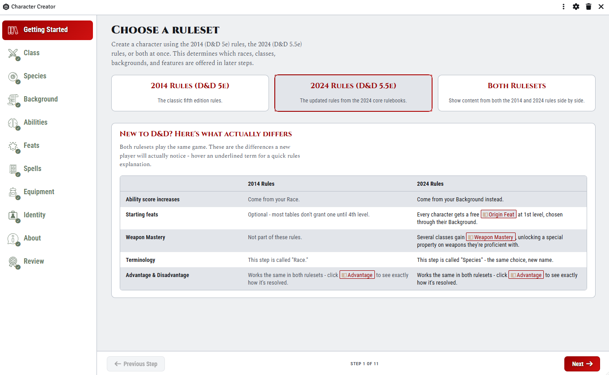
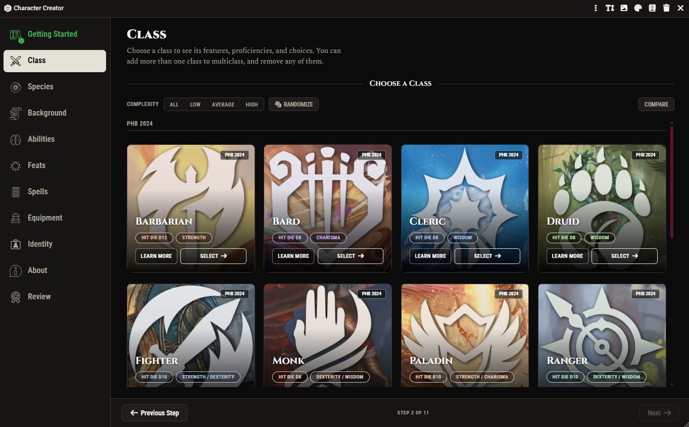
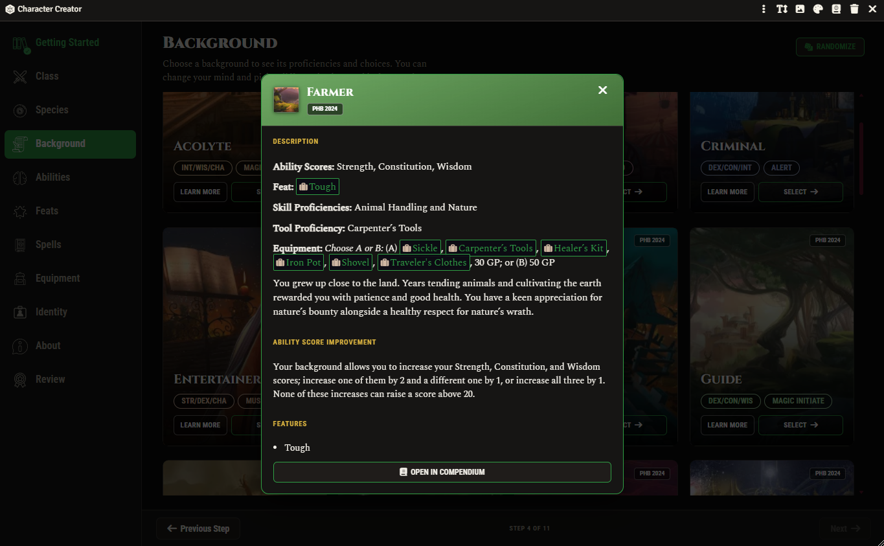
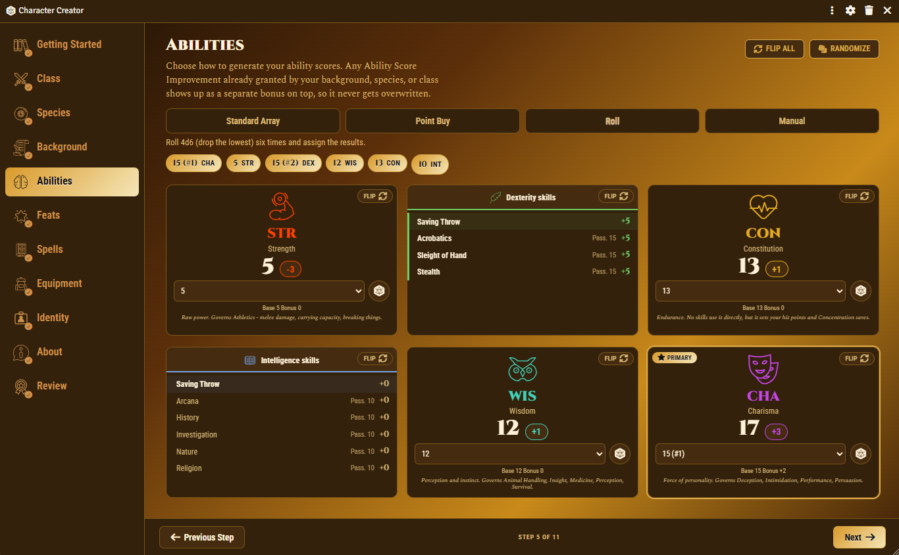
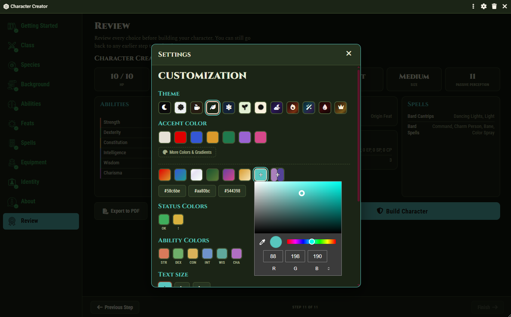
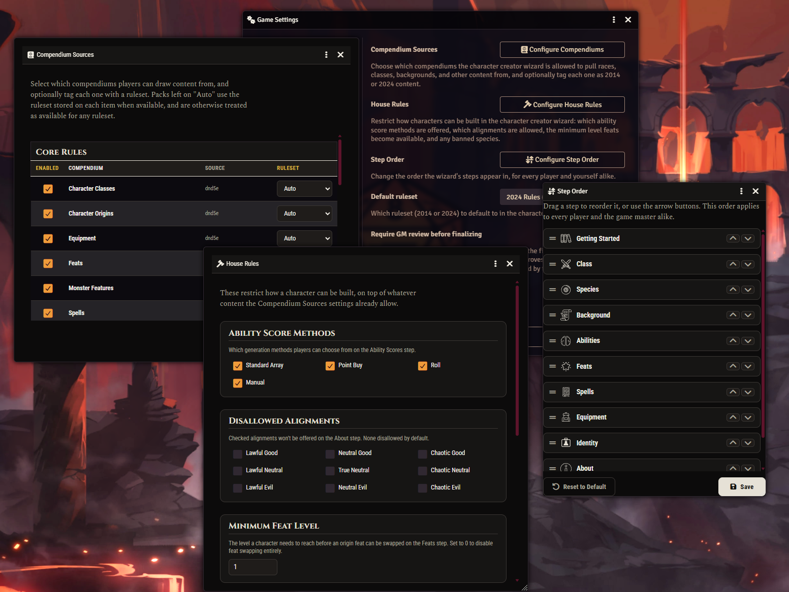

# D&D Character Creator

A Foundry VTT module that adds a step-by-step character creation wizard for the dnd5e system. It supports both rulesets: 2014 (5e) and 2024 (5.5e).

This module does not copy text from any book. It reads classes, species, backgrounds, feats, spells, and equipment from the compendiums already installed in your world (system packs, official modules like the Player's Handbook, and any homebrew content).

The module runs entirely locally. It does not send data anywhere, does not phone home, and does not collect any telemetry.

**Disclosure:** this module was built with the help of Claude - not fully AI-generated, but just being transparent about the tools used.

## Requirements

- Foundry VTT version 13 or 14.
- The dnd5e system, version 3.0 or newer.

## Installation

1. In Foundry, open "Add-on Modules" and add the module using its manifest link, or copy this folder into `Data/modules/`.
2. Enable the module in your world's settings.
3. Open the "Actors" tab. A button to create a character will appear there.
4. The wizard creates a real Actor for the draft character, so players need the "Create New Actors" permission. By default Foundry only grants this to the game master. Go to **Configure Permissions** and enable "Create New Actors" for the Player role (or for individual players) so they can use the wizard themselves.
5. The "Add Custom" buttons (a quick way to add a homebrew class, species, background, feat, or subclass) create a real world Item, which needs the "Create Items" permission - also off by default for players. Enable it the same way if you want players to use those buttons themselves.

## What the wizard does

- Eleven steps: Getting Started, Class, Species, Background, Abilities, Feats, Spells, Equipment, Identity, About, Review.
- The Getting Started step explains what actually differs between the 2014 and 2024 rules (in the module's own words, not copied text), with hover links to the real rules glossary for terms like Advantage or Weapon Mastery.
- Choosing a ruleset (2014, 2024, or both) controls which content is offered.
- Multiclassing: add as many classes as you want and remove any of them. A class card's "Learn More" panel includes a level-by-level breakdown of what it grants at each level, so you can see what's ahead before committing.
- Species that are split into several variants in the compendiums (for example Elf: Drow, High, Wood) show up as one card with a variant picker, instead of separate cards.
- Ability scores are shown as flip cards - the front has whichever generation method you're using (standard array, point buy, dice roll, or manual entry), the back shows that ability's saving throw and the skills it governs. A "Randomize" button exists on the Class, Species, Background, and Abilities steps for a quick, still-editable starting point. Each ability card's icon can be either dnd5e's own official set or the module's own hand-picked alternative, from the Settings panel.
- The step rail on the left can be collapsed down to just its icons to save space, and expands back with one click. It remembers your choice.
- The Feats step has a general feat browser (not just your background's own feat), with a prerequisite level shown per feat and a warning if your character doesn't meet it yet.
- Character advancement (skill picks, traits, subclass choices, and so on) happens right inside the wizard window, with no separate popups - including the item browser used to pick spells, equipment, and subclasses.
- The Equipment step lets you pick a starting kit from your class or background, or buy your own gear using the character's real money (you cannot buy something you cannot afford). Your inventory is grouped by where each item came from, and the shop shows a running itemized cart while you shop.
- The "Learn More" button on a class, species, or background card shows its real compendium description, ability score improvements, and granted features, with a link to open it in the compendium.
- A finished character can be leveled up later from its own character sheet, using the same guided steps as creation.
- The "Add Custom" button quickly creates a placeholder for a homebrew class, species, background, feat, or subclass, which you can then finish by hand on its own item sheet.
- The character's portrait and name can be edited from any step.
- A finished character can be exported as a printable PDF (matching the wizard's own visual design, with a portrait, ability score cards, and a full spell list) or a Foundry Journal Entry. A blank, hand-fillable version of the same PDF sheet - with no character data on it - can also be downloaded for a physical paper copy. Every export includes a combined table of weapon attacks and damage-dealing cantrips with real, computed attack bonuses and damage.
- The "Start Over" button lets you delete the current draft character and begin a new one.
- A Settings panel (the gear icon in the window's title bar) lets each player pick their own theme, accent color, text size, and a "Simplify" mode that strips card artwork and gradients - purely a personal display preference, not shared with the table.
  - Twelve themes are available: Dark, Light, Sepia, Wildwood, Frostspire, Meadow, Honeycomb, and five gradient themes (Twilight, Ember, Aurora, Bloodmoon, Sunspire) that sweep the whole window through a real color gradient instead of one flat background.
  - The accent color, the step rail's "complete"/"needs attention" colors, and all six ability score colors can each be set to a preset, a gradient, or a fully custom color (typed as a hex code or picked from a palette). One button resets all of this back to default.

## Settings for the game master

All settings are available through the module's menu in the world's Configure Settings screen.

**Compendium Sources.** A list of every installed pack that contains items. The game master chooses which packs the wizard can use, and can optionally tag each one as 2014, 2024, or both.

**House Rules.** Lets you restrict:
- which ability score generation methods players can use, and Point Buy's own score range and point budget;
- whether rerolling a rolled ability score is allowed;
- which alignments are not allowed;
- the minimum level needed to pick a feat, and which specific feats, species, or classes are banned outright;
- whether multiclassing is allowed at all;
- bonus starting gold on top of the normal starting kit;
- whether players can level up their own finished characters once they've earned enough XP.

**Step Order.** Change the order the wizard's steps appear in, for every player and the game master alike.

**Default Ruleset.** Which ruleset (2014, 2024, or both) a new character starts with.

**Require GM review before finalizing.** When turned on, a player's "Build Character" button does not finish the character right away. Instead it sends the game master a chat card asking for approval. The game master is never subject to this setting. It is off by default.

**Character Creation Progress.** A button next to "Create Character" in the Actor Directory lists every player's in-progress draft and every finished character, with their current step and what's still missing, so the game master can jump in and help directly - including raising or lowering a finished character's level right from the dashboard.

## Settings for players

- The "Sources" button in the wizard's Settings panel lets a player personally hide any content source the game master has enabled (for example, a book the player does not own). This only affects that player's own view, not the table's settings.
- A "My Characters" button next to "Create Character" shows a player their own drafts and finished characters at a glance - a read-only view of the same information the game master's own dashboard has.

## Screenshots

| | |
|---|---|
|  Getting started, with the 2014-vs-2024 differences explained inline |  Choosing a class |
|  Learn More, with the real compendium description |  Generating ability scores, with a flip-card back showing saves and skills |
|  Themes, accent colors, and status/ability colors, all customizable |  Game master settings |

## Language

The interface is English only.

## License

MIT. See the [LICENSE](LICENSE) file.
